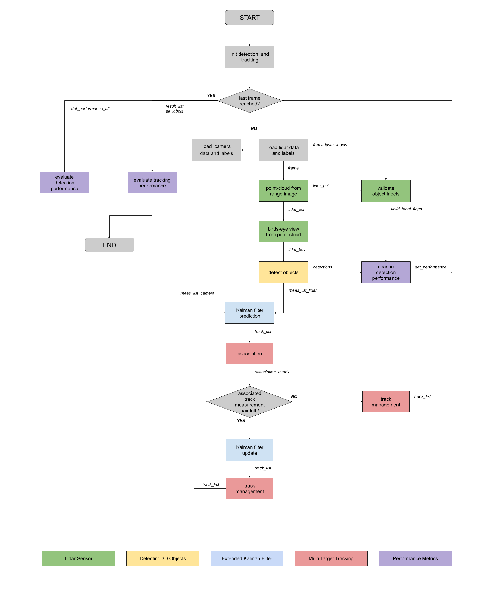

# SDCND : Sensor Fusion and Tracking
This is the project for the second course in the  [Udacity Self-Driving Car Engineer Nanodegree Program](https://www.udacity.com/course/c-plus-plus-nanodegree--nd213) : Sensor Fusion and Tracking. 

In this project, you'll fuse measurements from LiDAR and camera and track vehicles over time. You will be using real-world data from the Waymo Open Dataset, detect objects in 3D point clouds and apply an extended Kalman filter for sensor fusion and tracking.

The project consists of two major parts: 
1. **Object detection**: In this part, a deep-learning approach is used to detect vehicles in LiDAR data based on a birds-eye view perspective of the 3D point-cloud. Also, a series of performance measures is used to evaluate the performance of the detection approach. 
2. **Object tracking** : In this part, an extended Kalman filter is used to track vehicles over time, based on the lidar detections fused with camera detections. Data association and track management are implemented as well.

The following diagram contains an outline of the data flow and of the individual steps that make up the algorithm. 

Also, the project code contains various tasks, which are detailed step-by-step in the code. More information on the algorithm and on the tasks can be found in the Udacity classroom. 

## Project File Structure

📦project 
 ┣ 📂dataset --> contains the Waymo Open Dataset sequences  
 ┃ 
 ┣ 📂misc 
 ┃ ┣ evaluation.py --> plot functions for tracking visualization and RMSE calculation 
 ┃ ┣ helpers.py --> misc. helper functions, e.g. for loading / saving binary files 
 ┃ ┗ objdet_tools.py --> object detection functions without student tasks 
 ┃ ┗ params.py --> parameter file for the tracking part 
 ┃  
 ┣ 📂results --> binary files with pre-computed intermediate results 
 ┃  
 ┣ 📂student  
 ┃ ┣ association.py --> data association logic for assigning measurements to tracks incl. student tasks  
 ┃ ┣ filter.py --> extended Kalman filter implementation incl. student tasks  
 ┃ ┣ measurements.py --> sensor and measurement classes for camera and lidar incl. student tasks  
 ┃ ┣ objdet_detect.py --> model-based object detection incl. student tasks  
 ┃ ┣ objdet_eval.py --> performance assessment for object detection incl. student tasks  
 ┃ ┣ objdet_pcl.py --> point-cloud functions, e.g. for birds-eye view incl. student tasks  
 ┃ ┗ trackmanagement.py --> track and track management classes incl. student tasks   
 ┃  
 ┣ 📂tools --> external tools 
 ┃ ┣ 📂objdet_models --> models for object detection 
 ┃ ┃ ┃ 
 ┃ ┃ ┣ 📂darknet 
 ┃ ┃ ┃ ┣ 📂config 
 ┃ ┃ ┃ ┣ 📂models --> darknet / yolo model class and tools 
 ┃ ┃ ┃ ┣ 📂pretrained --> copy pre-trained model file here 
 ┃ ┃ ┃ ┃ ┗ complex_yolov4_mse_loss.pth 
 ┃ ┃ ┃ ┣ 📂utils --> various helper functions 
 ┃ ┃ ┃ 
 ┃ ┃ ┗ 📂resnet 
 ┃ ┃ ┃ ┣ 📂models --> fpn_resnet model class and tools 
 ┃ ┃ ┃ ┣ 📂pretrained --> copy pre-trained model file here  
 ┃ ┃ ┃ ┃ ┗ fpn_resnet_18_epoch_300.pth  
 ┃ ┃ ┃ ┣ 📂utils --> various helper functions 
 ┃ ┃ ┃ 
 ┃ ┗ 📂waymo_reader --> functions for light-weight loading of Waymo sequences 
 ┃ 
 ┣ basic_loop.py 
 ┣ loop_over_dataset.py 

## Installation Instructions for Running Locally
### Cloning the Project
In order to create a local copy of the project, please click on "Code" and then "Download ZIP". Alternatively, you may of-course use GitHub Desktop or Git Bash for this purpose. 

### Python
The project has been written using Python 3.7. Please make sure that your local installation is equal or above this version. 

### Package Requirements
All dependencies required for the project have been listed in the file `requirements.txt`. You may either install them one-by-one using pip or you can use the following command to install them all at once: 
`pip3 install -r requirements.txt` 

### Waymo Open Dataset Reader
The Waymo Open Dataset Reader is a very convenient toolbox that allows you to access sequences from the Waymo Open Dataset without the need of installing all of the heavy-weight dependencies that come along with the official toolbox. The installation instructions can be found in `tools/waymo_reader/README.md`. 

### Waymo Open Dataset Files
This project makes use of three different sequences to illustrate the concepts of object detection and tracking. These are: 
- Sequence 1 : `training_segment-1005081002024129653_5313_150_5333_150_with_camera_labels.tfrecord`
- Sequence 2 : `training_segment-10072231702153043603_5725_000_5745_000_with_camera_labels.tfrecord`
- Sequence 3 : `training_segment-10963653239323173269_1924_000_1944_000_with_camera_labels.tfrecord`

To download these files, you will have to register with Waymo Open Dataset first: [Open Dataset – Waymo](https://waymo.com/open/terms), if you have not already, making sure to note "Udacity" as your institution.

Once you have done so, please [click here](https://console.cloud.google.com/storage/browser/waymo_open_dataset_v_1_2_0_individual_files) to access the Google Cloud Container that holds all the sequences. Once you have been cleared for access by Waymo (which might take up to 48 hours), you can download the individual sequences. 

The sequences listed above can be found in the folder "training". Please download them and put the `tfrecord`-files into the `dataset` folder of this project.

### Pre-Trained Models
The object detection methods used in this project use pre-trained models which have been provided by the original authors. They can be downloaded [here](https://drive.google.com/file/d/1Pqx7sShlqKSGmvshTYbNDcUEYyZwfn3A/view?usp=sharing) (darknet) and [here](https://drive.google.com/file/d/1RcEfUIF1pzDZco8PJkZ10OL-wLL2usEj/view?usp=sharing) (fpn_resnet). Once downloaded, please copy the model files into the paths `/tools/objdet_models/darknet/pretrained` and `/tools/objdet_models/fpn_resnet/pretrained` respectively.

### Using Pre-Computed Results

In the main file `loop_over_dataset.py`, you can choose which steps of the algorithm should be executed. If you want to call a specific function, you simply need to add the corresponding string literal to one of the following lists: 

- `exec_data` : controls the execution of steps related to sensor data. 
  - `pcl_from_rangeimage` transforms the Waymo Open Data range image into a 3D point-cloud
  - `load_image` returns the image of the front camera

- `exec_detection` : controls which steps of model-based 3D object detection are performed
  - `bev_from_pcl` transforms the point-cloud into a fixed-size birds-eye view perspective
  - `detect_objects` executes the actual detection and returns a set of objects (only vehicles) 
  - `validate_object_labels` decides which ground-truth labels should be considered (e.g. based on difficulty or visibility)
  - `measure_detection_performance` contains methods to evaluate detection performance for a single frame

In case you do not include a specific step into the list, pre-computed binary files will be loaded instead. This enables you to run the algorithm and look at the results even without having implemented anything yet. The pre-computed results for the mid-term project need to be loaded using [this](https://drive.google.com/drive/folders/1-s46dKSrtx8rrNwnObGbly2nO3i4D7r7?usp=sharing) link. Please use the folder `darknet` first. Unzip the file within and put its content into the folder `results`.

- `exec_tracking` : controls the execution of the object tracking algorithm

- `exec_visualization` : controls the visualization of results
  - `show_range_image` displays two LiDAR range image channels (range and intensity)
  - `show_labels_in_image` projects ground-truth boxes into the front camera image
  - `show_objects_and_labels_in_bev` projects detected objects and label boxes into the birds-eye view
  - `show_objects_in_bev_labels_in_camera` displays a stacked view with labels inside the camera image on top and the birds-eye view with detected objects on the bottom
  - `show_tracks` displays the tracking results
  - `show_detection_performance` displays the performance evaluation based on all detected 
  - `make_tracking_movie` renders an output movie of the object tracking results

Even without solving any of the tasks, the project code can be executed. 

The final project uses pre-computed lidar detections in order for all students to have the same input data. If you use the workspace, the data is prepared there already. Otherwise, [download the pre-computed lidar detections](https://drive.google.com/drive/folders/1IkqFGYTF6Fh_d8J3UjQOSNJ2V42UDZpO?usp=sharing) (~1 GB), unzip them and put them in the folder `results`.

## External Dependencies
Parts of this project are based on the following repositories: 
- [Simple Waymo Open Dataset Reader](https://github.com/gdlg/simple-waymo-open-dataset-reader)
- [Super Fast and Accurate 3D Object Detection based on 3D LiDAR Point Clouds](https://github.com/maudzung/SFA3D)
- [Complex-YOLO: Real-time 3D Object Detection on Point Clouds](https://github.com/maudzung/Complex-YOLOv4-Pytorch)

## License
[License](LICENSE.md)

# Mid-Term Project: 3D Object Detection

## Project overview
Object detection is a crucial  role in self-driving cars. In this project we will focus on 3D object detection with a LIDAR sensor which can improve the robustness of the object detection for self- driving cars.
This project will show how to use the LIDAR data (Range Image) to produce a 3D Point-CLoud (PCL), with this PCL we can produce another view called Birds-Eye View  (BEV) , which is a 2D image which enable us to use a 2D object detection algorithm to detect objects in the 3D coordinate system, normally we use three layers of BEV image ( height, intensity and density maps). It will also show how to use the  "darknet" and "fpn_resnet" models to classify objects from a BEV image and how to calculate the performance evaluation using IOU, precision and recall metrics.

## Compute Lidar Point-Cloud from Range Image
### Visualize range image channels (ID_S1_EX1)
To prepare this task you should set the following parameters in `loop_over_dataset.py` between lines 51 and 61:
-` model = "darknet"`
-` sequence = "1"`
-` show_only_frames = [0, 1] `
-` exec_data = [] `
-` exec_detection = [] `
-` exec_tracking = [] `
-` exec_visualization = ['show_range_image'] `

The resulting range image with handmade markings is shown below:

The range image is in the top and the intensity is in the bottle of the figure. With the insentity figure is easier to identify the vehicle features.

### Visualize point-cloud (ID_S1_EX2)
To prepare this task you should set the following parameters in `loop_over_dataset.py` between lines 51 and 61:
-` model = "darknet"`
-` sequence = "3"`
-` show_only_frames = [0, 200] `
-` exec_data = [] `
-` exec_detection = [] `
-` exec_tracking = [] `
-` exec_visualization = ['show_pcl'] `

The resulting 3D point-cloud in many differnts views with handmade markings is shown below:

In this imagens we can identify a van marked in purple, poles or trees in gray, car rearview mirror in orange, car headlight in pink, rear and bumper of the car in yellow, pickup truck wheels in green, rear of truck in red, truck body in blue and a road sign in light blue.
We can also compare this vehicles features and objects with the range and intensity image of the previous part.

You can pass to the next frame by pressing the right arrow key, stop the image by pressing space bar key, toggle to full with tab key and close with esc key.

## Create Birds-Eye View from Lidar PCL
To prepare the following three tasks you should set the following parameters in `loop_over_dataset.py` between lines 51 and 61:
-` model = "darknet"`
-` sequence = "1"`
-` show_only_frames = [0, 1] `
-` exec_data = ['pcl_from_rangeimage'] `
-` exec_detection = ['bev_from_pcl'] `
-` exec_tracking = [] `
-` exec_visualization = [] `

If a segmentation fault message appears, hold the space bar key before PCL appears. To pass to the BEV image press the right arrow key. In BEV image press spacebar key to stop the image and press esc to jump for the next one.

### Convert sensor coordinates to bev-map coordinates (ID_S2_EX1)
The resulting image of the first step to create a birds-eye view (BEV) perspective of the lidar point-cloud is shown below:

### Compute intensity layer of bev-map (ID_S2_EX2)
The resulting image of intensity layer of birds-eye view (bev)-map is shown below:

### Compute height layer of bev-map (ID_S2_EX3)
The resulting image of height layer of birds-eye view (bev)-map is shown below:

## Model-based Object Detection in BEV Image
To prepare these two following tasks you should set the following parameters in `loop_over_dataset.py` between lines 51 and 61:
-` model = "fpn_resnet"`
-` sequence = "1"`
-` show_only_frames = [50, 51] `
-` exec_data = ['pcl_from_rangeimage', 'load_image'] `
-` exec_detection = ['bev_from_pcl', 'detect_objects'] `
-` exec_tracking = [] `
-` exec_visualization = ['show_objects_in_bev_labels_in_camera'] `

### Add a second model from a GitHub repo (ID_S3_EX1)
From the [Super Fast and Accurate 3D Object Detection based on 3D LiDAR Point Clouds](https://github.com/maudzung/SFA3D) I create a second add a second object detection model called `fpn_resnet`.
The most relevant informations are available in `SFA3D->test.py->parse_test_configs()` to add them in the `configs` structure in `load_configs_model.`

### Extract 3D bounding boxes from model response (ID_S3_EX2)
With the fpn_resnet object detection configure we can detect the vehicles using the information of the BEV images like a RGB image, instead of the layers of colors we will use images layers maps of height, intensity and density, already calculated in the previous parts.
We can see the result of the object detection in the following video using ` show_only_frames = [0, 150] ` and lidar_bev = pcl.bev_from_pcl(lidar_pcl, configs_det, False). The false disable PCL and BEV plots.

## Performance Evaluation for Object Detection
To prepare these two following tasks you should set the following parameters in `loop_over_dataset.py` between lines 51 and 61:
-` model = "fpn_resnet"`
-` sequence = "1"`
-` show_only_frames = [50, 51] `
-` exec_data = ['pcl_from_rangeimage'] `
-` exec_detection = ['bev_from_pcl', 'detect_objects', 'validate_object_labels', 'measure_detection_performance'] `
-` exec_tracking = [] `
-` exec_visualization = ['show_detection_performance'] `
### Compute intersection-over-union (IOU) between labels and detections (ID_S4_EX1)
Intersection-over-union (IOU) is a metric to measure how good the preditec bounding box is fitting to the label bounding box, it is calculated by `Intersection_of_bb/Union_of_bb`. A value equal to one means perfect fit and a value zeros means missed detection. Normally we use a threshold (min_iou=0.5) to classify a detection as a reliable detection.

### Compute true-positive (TP), false-negatives (FN) and false-positives (FP) (ID_S4_EX2)
- TP = all detections with iou > min_iou
- FN = all positive labels - TP
- FP = all detections - TP

### Compute precision and recall (ID_S4_EX3)
The calculus of precision and recall can be done as follows 
- Precision = TP / (TP + FP) = TP / All_detections
- Recall = TP / (TP + FN) = TP / All_positives

To prepare this last task you should set the following parameters in `loop_over_dataset.py` between lines 51 and 61:
-` model = "fpn_resnet"`
-` sequence = "1"`
-` show_only_frames = [50, 150] `
-` exec_data = ['pcl_from_rangeimage'] `
-` exec_detection = ['bev_from_pcl', 'detect_objects', 'validate_object_labels', 'measure_detection_performance'] `
-` exec_tracking = [] `
-` exec_visualization = ['show_detection_performance'] `

In the following figure we can se the evaluation of 100 frames of the precision, recall, IOU and the error in each axis between the label and the detection. 
With `precision = 0.9323, recall = 0.9444`

Changing ` model = "darknet"` we have the following result:
With `precision = 1.0, recall = 0.8529`

To make sure that the code produces plausible results we can use the following flag `configs_det.use_labels_as_objects = True` which will use groundtruth labels as objects. An we can validate the algorithm with the following result as expected:
With `precision = 1.0, recall = 1.0`

