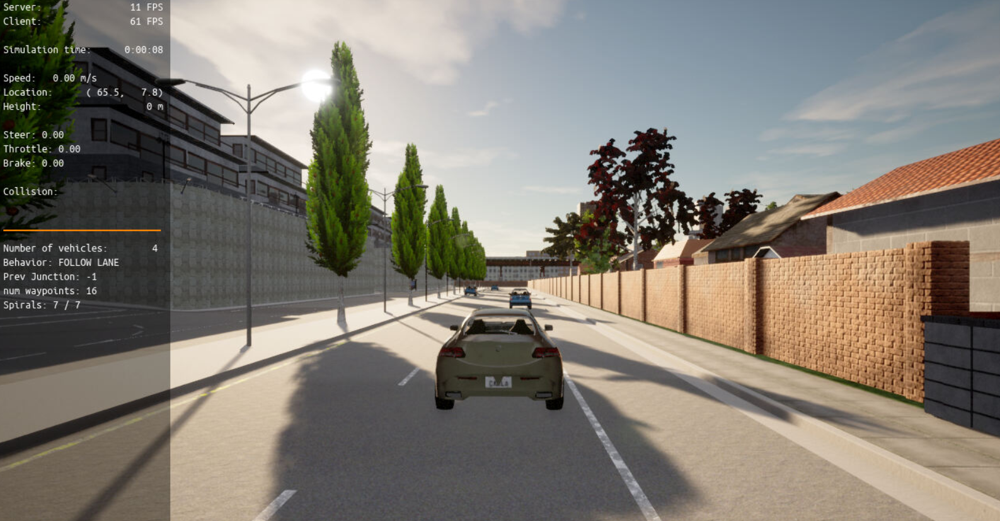
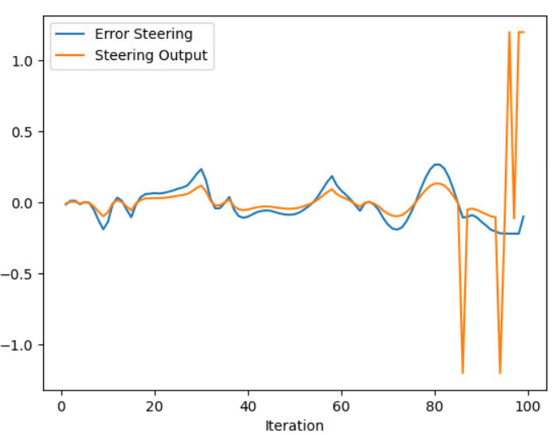

# Control and Trajectory Tracking for Autonomous Vehicle

This project is the continuation of the Planning project. A real autonomous vehicle need to be controlled, in this project I used the motion planning as the reference of the controller, the input of the controller will be the steering angle and the throttle as a human driving a car to follow the trajectory. There is many controllers in the literature and the most famous and simplest is the PID controller.

This project was based in the Udacity repository https://github.com/udacity/nd013-c6-control-starter/tree/master.


# Proportional-Integral-Derivative (PID)

In this project, you I applied the skills I have acquired in the course to design a PID controller to perform vehicle trajectory tracking. Given a trajectory as an array of locations, and a simulation environment, you I design and code a PID controller and test its efficiency on the CARLA simulator used in the industry.

## Compile and Run
### Run Carla Simulator

Open new window

* `cd /opt/carla-simulator/`
* `SDL_VIDEODRIVER=offscreen ./CarlaUE4.sh -opengl`

### Compile and Run the Controller

Open new window

* `cd project`
* `./install-ubuntu.sh`
* `cd project/pid_controller/`
* `rm -rf rpclib`
* `git clone https://github.com/rpclib/rpclib.git`
* `cmake .`
* `make` (This last command compiles your c++ code, run it after every change in your code)

### Testing

To test your installation run the following commands.

* `cd project`
* `./run_main_pid.sh`
This will silently fail `ctrl + C` to stop
* `./run_main_pid.sh` (again)
Go to desktop mode to see CARLA

If error bind is already in use, or address already being used

* `ps -aux | grep carla`
* `kill id`

## Project File Structure

📦project<br>
 ┣ 📂pid_controller --> contains the control and planning algorithms <br>
 ┃ ┣ behavior_planner_FSM.cpp --> Behavior planner with Finite State Machine <br>
 ┃ ┣ cost_function.cpp --> Cost function of possible paths <br>
 ┃ ┣ main.cpp --> main file calling the planning and control algorithm to communicate with Carla simulator <br>
 ┃ ┣ motion_planner.cpp --> Motion planner using the spiral <br>
 ┃ ┣ pid_controller.cpp --> PID contrller class <br>
 ┃ ┣ planning_params.h --> parameters to adjust the planning algorithm <br>
 ┃ ┣ vehicle_dynamic_model.cpp --> vehicle dynamics model <br>
 ┃ ┗ velocity_profile_generator.cpp --> velocity profile generator <br>
 ┃ <br>
 ┣ install-ubuntu.sh --> install ubuntu requirements <br>
 ┣ plot_pid.py --> plot steer and throttle data <br>
 ┣ run_main_pid.sh --> sh to run the main file <br>
 ┣ throttle_pid_data.txt --> throttle data to plot <br>
 ┗ steer_pid_data.txt --> steer data to plot <br>


### Step 1: Build the PID controller object

In this part I created the class PID controller in the files pid_controller.h and pid_controller.cpp to have a generic PID controller.
The PID controller is a simple controller with three actions (Proportional using the Kp gain, Integral using the Ki grain and derivative using the Kd gain) as shown in the following figure.


In this class I also create a saturation block between the controller and the system/process because in real applications the input of the system is limited and depends on the system.

I ran the simulator and saw in the CARLA simulator the vehicle was stopped as in the following figure. It is normal because the class controller was created but I need to create the controller object for the steering system and the throttle and brake system.




The following controller were implemented in the main.cpp file.

### Step 2: PID controller for throttle:
The control of the throttle and brake is not difficult due to the simplicity to calculate the error. The error is the speed difference between the desired speed and the actual speed. And the saturation block should be inside [-1, 1].
The error was calculated by this way because the error is the setpoint/reference - output, in this case I am evaluating speed. So it will be the `error_speed = reference_speed_of_the_planner - current_speed`

Tune this PID controller was not easy because the throttle and brake are very sensitive.

### Step 3: PID controller for steer:
The control of the steering system is more difficult due to the complexity to calculate the error and the instability generated by oscillations in the steering angle. The error is the angle difference between the desired steer to reach the planned position and actual steer. And the saturation block should be inside [-1.2, 1.2].

To calculate the angle we must know the desired steer to each the planned position, and to do this calculus I calculated the `x_error = x_planned - x_position` and the `y_error = y_planned - y_position`, and I found the angle using the arctangent `reference_angle =  std::atan2(y_error, x_error)`. Hence, the error considered was: `error_steer = reference_angle - yaw_angle`.

Tune this PID controller was very hard because the steering system is an instable system in open loop, so after many tests I found some values able to stabilize the system in closed loop.

### Step 4: Evaluate the PID efficiency
The values of the error and the pid command are saved in thottle_data.txt and steer_data.txt.
Is possible to plot the saved values using the command (inside /project):

```
python3 plot_pid.py
```
- Steering Control


- Throttle Control


Throttle and brake are complementary and inversely proportional.

This system is not easy to control because is a Multiple-Input Multiple-Output (MIMO) and it is also coupled (the steer and throttle are not 100% independent because the steer depends on the x and y position that are modified by the throttle).
It is evident the smaller steady state error in steering compared to throttle, I made this choice because the steering control is difficult to stabilize, and it is also easier to stabilize when the speed is slower. Perhaps it is possible to improve the Throttle controller by increasing the Kp and Ki, but it may generate a bad impact in the steering control.
Furthermore, there is some spikes probably generated by the derivative part of the PID, because the derivate of a sudden change is big.

## Final Result

This is the result of the throttle and brake control and the steering control to follow the path defined by the motion planning algorithm.


## Answered questions:
- What is the effect of the PID according to the plots, how each part of the PID affects the control command?
  * Proportional:
    * Pros: Makes the system more reactive and faster and reduce  steady state error
    * Cons: Increase oscillations and instability
  * Integral:
    * Pros: Reduce steady state error
    * Cons: Increase oscillations and risk os instability
  * Derivative:
    * Pros: Makes the system more damped
    * Cons: Increase oscillations if is too high and makes the system slower

- How would you design a way to automatically tune the PID parameters?
  * It is possible to use the twiddle iterative technique or reinforcement learning to adjust the Kp, Ki and Kd iteratively. It is also possible to use Ziegler Nichols oscillation method or Ziegler Nichols open loop method to estimate the Kp, Ki and Kd based in the response of the system.

- PID controller is a model free controller, i.e. it does not use a model of the car. Could you explain the pros and cons of this type of controller?
  * Pros: We can control a system without know its model, it is very piratical in the reality because normally the model are simplification of the reality, so they are not perfect.
  * Cons: It is very time consuming to tune the gains empirically, if the system is instable is difficult to stabilize, as the case of steering angle. Normally it is not optimal compared model based techniques such as pole placement, optimal control and predictive control.

- What would you do to improve the PID controller?
  * As I worked with a simulation it is not difficult to use a iterative solution to tune the PID such as twiddle and reinforcement learning. Furthermore, it is possible to improve the throttle controller to reduce the steady state error.
