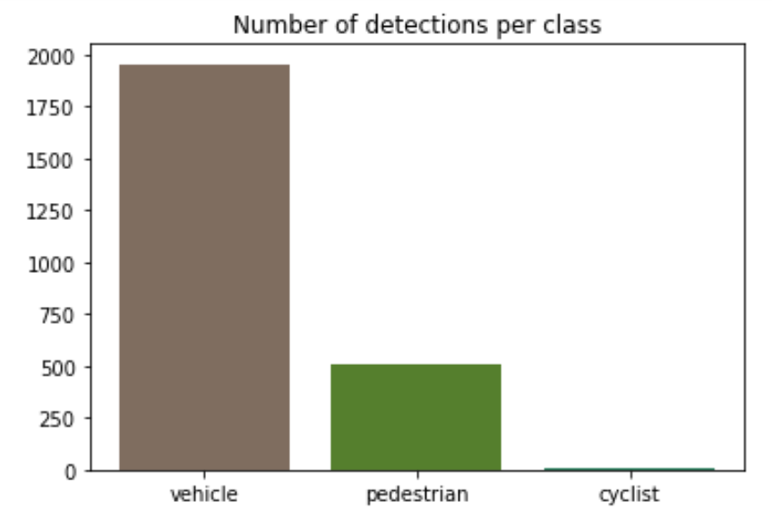
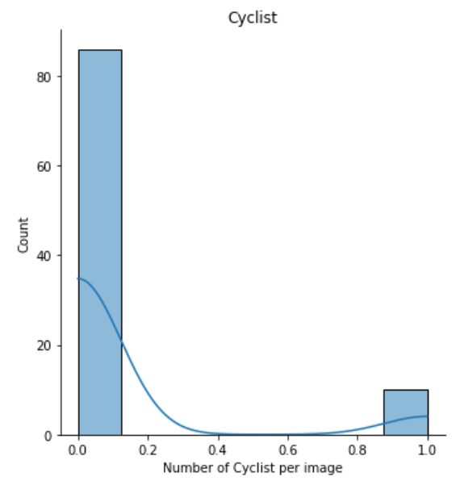
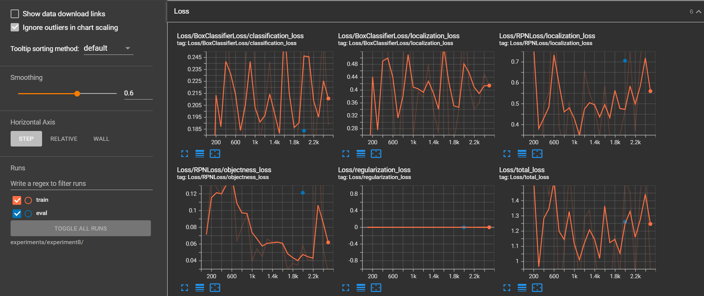

# Object Detection in an Urban Environment

## Project overview
Object detection is a crucial  role in self-driving cars. In this project we will focus on two main parts, the dataset and the training and validation of our model.
The dataset has a key role in machine learning, because our model learns with supervised learning, so it will use our labeled data to generalize the information from the data. Due to this fact it is important to have representative images in many different conditions, which the car may find in real life and we also need to give a dataset with the number of objects per class as close as possible in order to avoid generating a bias in the model prediction.
Furthermore, the training and validation part is also a crucial part. Because there are several possibilities of different architectures and the engineer needs to choose the best one to improve the final performance playing with the trade-off of overfitting and underfitting. 

## Set up

### Requirements

To install the required packages there is a container file `Dockerfile` and a `requirements.txt` in the folder `build`, more details available in the README in this folder.


### Data

For this project, we will be using data from the [Waymo Open dataset](https://waymo.com/open/).

[OPTIONAL] - The files can be downloaded directly from the website as tar files or from the [Google Cloud Bucket](https://console.cloud.google.com/storage/browser/waymo_open_dataset_v_1_2_0_individual_files/) as individual tf records. We have already provided the data required to finish this project in the workspace, so you don't need to download it separately.
The first goal of this project is to download the data from the Waymo's Google Cloud bucket to your local machine. For this project, we only need a subset of the data provided (for example, we do not need to use the Lidar data). Therefore, we are going to download and trim immediately each file. In `download_process.py`, you can view the `create_tf_example` function, which will perform this processing. This function takes the components of a Waymo Tf record and saves them in the Tf Object Detection api format. An example of such function is described [here](https://tensorflow-object-detection-api-tutorial.readthedocs.io/en/latest/training.html#create-tensorflow-records). We are already providing the `label_map.pbtxt` file.

You can run the script using the following command:
```
python download_process.py --data_dir {processed_file_location} --size {number of files you want to download}
```

### Structure

The data used for training, validation and testing is organized in `data` folder as follow:

```
data/waymo/
    - training_and_validation - contains 96 files to train and validate your models
    - train: contain the train data
    - val: contain the val data
    - test - contains 3 files to test your model and create inference videos
```
The `training_and_validation` folder contains file that have been downsampled: we have selected one every 10 frames from 10 fps videos. The `testing` folder contains frames from the 10 fps video without downsampling.

To split this `training_and_validation` data into `train`, and `val` you can use the `create_splits.py` file.

The `experiments` folder is organized as follow:

```
experiments/
    - label_map.pbtxt
    - reference/... reference training with the unchanged config file
    - exporter_main_v2.py: to create an inference model
    - model_main_tf2.py: to launch training
    - experiment0/... create a new folder for each experiment runned
    - experiment1/...
    - experimentX/...
    - pretrained-model/: contains the checkpoints of the pretrained models (FRCNN  and SDD).
```


##Dataset

### Dataset Analysis

In the `Exploratory Data Analysis` notebook it is possible to explore the dataset from the tfrecord format. By using the `display_images` function it is possible to visualize a frame of the dataset with the bounding box with different colors for each class, reto to vehicle, blue to pedestrian and green to cyclist. Hence, it is possible to use this function to visualize the imagens from the dataset and analyze the quality of them.

We can see the result of this function displaying 10 images in the figures below:


After see many different images from this dataset we can conclude that all images are visible, with day, night, sunny and rainy conditions. Furthermore, without miss classification and repeated bounding boxes for the same object. We also visualized the three classes with their respective colors, however it is visible the higher quantity of vehicles.

In the `Exploratory Data Analysis` notebook there is also a statistical analysis of the data. In the following plots we can see the quantity of objects for each class, the distribution of vehicles, pedestrians and cyclists, and there is also plots with the mean bounding box width, height and area for each class.
With this data we can conclude that cars outnumber pedestrians, and pedestrians outnumber cyclists. This information is very relevant because it can bias the model to classify the object as a vehicle because it is more probable.
We can also conclude that there are normally between 0 and 35 vehicles per image. And for cyclists and pedestrians normally there aren't any. Furthermore, we can conclude that vehicles have on average similar height and width, so the bounding box is square, and pedestrians are higher than wide, as expected




### Create the training - validation splits
To split the dataset in three folder for cross-validation there is the `create_splits.py` file. This code will take all files in the `destination folder` and will create a  `destination folder `to store a folder for train data, another for validation and another for test.
The proportion of validation and test can be passed as parameters when executing this function. This split function will randomly distribute all the data from the `source folder` to the `destination folder` respecting the selected proportion.
 
```
python create_splits.py --destination data/waymo/splits --source data/waymo/training_and_validation_and_test --pval proportion_of_validation --ptest proportion_of_test
```


### Config file of the model

To train this model we will use a `pipeline.config` file, this file contains all the information to train and validate the model. We have the `pipeline.config` that has a SSD object detection architecture and `pipelinefrcnn.config` that has a Faster-RCNN object detection architecture.
Due to the complexity of the model and the similarity with other models we will use the fine tune to start our model, because it is not worth starting from scratch, there are many parameters to find and we can use the previous knowledge of another model to start our model.

To import the SSD pretrained model we can execute the following commands
```
cd experiments/pretrained_model/
wget http://download.tensorflow.org/models/object_detection/tf2/20200711/ssd_resnet50_v1_fpn_640x640_coco17_tpu-8.tar.gz
tar -xvzf ssd_resnet50_v1_fpn_640x640_coco17_tpu-8.tar.gz
rm -rf ssd_resnet50_v1_fpn_640x640_coco17_tpu-8.tar.gz
```

To import the Faster-RCNN pretrained  model we can execute the following commands
```
cd experiments/pretrained_model/
wget http://download.tensorflow.org/models/object_detection/tf2/20200711/faster_rcnn_resnet50_v1_640x640_coco17_tpu-8.tar.gz
tar -xvzf faster_rcnn_resnet50_v1_640x640_coco17_tpu-8.tar.gz
rm -rf faster_rcnn_resnet50_v1_640x640_coco17_tpu-8.tar.gz
```

We need to edit the config files to change the location of the training and validation files, as well as the location of the label_map file, pretrained weights. We also need to adjust the batch size. To do so, run the following:
```
python edit_config.py --train_dir data/waymo/train/ --eval_dir data/waymo/val/ --batch_size 2 --checkpoint experiments/pretrained_model/ssd_resnet50_v1_fpn_640x640_coco17_tpu-8/checkpoint/ckpt-0 --label_map experiments/label_map.pbtxt
```
The `edit_config.py` will generate the pipeline of SSD architecture, but it is also possible to use `edit_config_frcnn.py` to generate the Faster-RCNN architecture pipeline
```
python edit_config_frcnn.py --train_dir data/waymo/train/ --eval_dir data/waymo/val/ --batch_size 2 --checkpoint experiments/pretrained_model/faster_rcnn_resnet50_v1_640x640_coco17_tpu-8/checkpoint/ckpt-0 --label_map experiments/label_map.pbtxt
```
A new config file has been created, `pipeline_new.config`. Copy `pipeline_new.config` in experiments/reference/.
We will use this pipeline to train our model.

### Training

### Reference experiment

To launch the Tensorflow object detection API we can execute the `model_main_tf2.py` file. The most important file to pass as parameter is the path of `pipeline_new.config`, in this file we can change all relevant information of the model, such as data augmentation, type of architecture, steps of training, batch size, kernel size, number of convolution layer and layer before classification. We won't train the model from scratch, so we will use fine tuning to start our model as explained in the `pipeline.config` file. 
To launch the training process:
* a training process:
```
python experiments/model_main_tf2.py --model_dir=experiments/reference/ --pipeline_config_path=experiments/reference/pipeline_new.config
```
Once the training is finished, launch the evaluation process:
* an evaluation process:
```
python experiments/model_main_tf2.py --model_dir=experiments/reference/ --pipeline_config_path=experiments/reference/pipeline_new.config --checkpoint_dir=experiments/reference/
```

**Note**: Both processes will display some Tensorflow warnings, which can be ignored. You may have to kill the evaluation script manually using
`CTRL+C`.

To monitor the training, you can launch a tensorboard instance by running `python -m tensorboard.main --logdir experiments/reference/`. You will report your findings in the writeup.

This reference model will be used as a reference of performance for the next models.


#### Improve the performances

Most likely, this initial experiment did not yield optimal results. However, it is possible to make multiple changes to the config file to improve this model. One obvious change consists in improving the data augmentation strategy. The [`preprocessor.proto`](https://github.com/tensorflow/models/blob/master/research/object_detection/protos/preprocessor.proto) file contains the different data augmentation method available in the Tf Object Detection API.

To visualize the data augmentations, it is possible to use the  `Explore augmentations.ipynb` notebook.
Many different data augmentation strategies was used, horizontal flip to generate the same image but symmetric increasing the number of images, crop image to zoom a part of the image and create a new image, convert the RGB image in grayscale to make the network learn from the shape of the objects instead of the colors, adjust brightness to simulate a more or less sunny condition, adjust contrast to increase or decrease the difference between the objects, adjust saturation to increase or decrease the color sensitivity of the model.
We can see in the following figures some images with low saturation, grayscale, high contrast and saturation, it is important to check the images before the data augmentation because if we overdo it we can destroy the images. 


We also tried many other techniques to improve the performance, such as changing the optimizer, changing the learning rate, changing the architecture [model zoo](https://github.com/tensorflow/models/blob/master/research/object_detection/g3doc/tf2_detection_zoo.md) and increasing the steps.

Each test is stored in the `experiments/experimentX/` folder, due to the memory it is not possible to save all models in github, so I saved only the config, test and validation files.

* In the follow figures we can see the result of the reference model:


* In the follow figures we can see the result of the experiment0 (data augmentation):


* In the follow figures we can see the result of the experiment92 (10 k steps and brightness data augmentation):


* In the follow figures we can see the result of the experiment8 (Faster-RCNN):


* In the follow figures we can see the result of the experiment82 (Faster-RCNN 25 k steps data augmentation brightness and grayscale):


We can see the positive impact in the precision and recall by using the data augmentation, the regularization loss is higher but this loss is just to prevent overfitting, it is not related with the performance of the model. Furthermore as the training model is in underfitting, when we increase the steps the performance also increase.
Moreover, the performance of the Faster-RCNN is better due to its complexity, so the training already starts better than the SSD ones. We can`t see a visible improvement of Faster-RCNN loss but the final result is better because the pre-trained model has better performance. With the aim to generate the best model I created the experiment82 that unites data augmentation, more steps and the Faster-RCNN model.
Furthermore, as the most import thing is detect all obstacles, so we should decrease the false negative rate, so the most import metric to analyze is the recall.

### Creating an animation
#### Export the trained model
Once the model has been trained we can export it to use it. In this example we will export experiment82, which is the best one.
To export the trained model we can execute the following command:

```
python experiments/exporter_main_v2.py --input_type image_tensor --pipeline_config_path experiments/experiment82/pipeline_new.config --trained_checkpoint_dir experiments/experiment82/ --output_directory experiments/experiment82/exported/
```

This should create a new folder `experiments/reference/exported/saved_model`. You can read more about the Tensorflow SavedModel format [here](https://www.tensorflow.org/guide/saved_model).

Finally, you can create a video of this model's inferences for any tf record file. I will take a tf record from the test folder to test the performance of this model. To do so, run the following command:

```
python inference_video.py --labelmap_path label_map.pbtxt --model_path experiments/experiment82/exported/saved_model --tf_record_path data/waymo/test/segment-12200383401366682847_2552_140_2572_140_with_camera_labels.tfrecord --config_path experiments/experiment82/pipeline_new.config --output_path output_gif/animation.gif
```

#### Final Result

It is possible to see the final result of the Object Detection of vehicle, pedestrian and cyclist in the three following GIFs:


